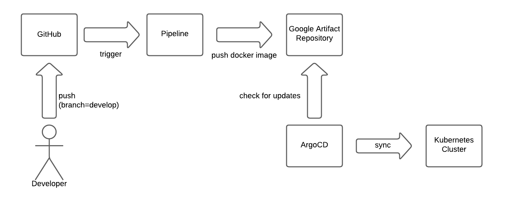

# kbot

Link [yevhenhrytsai_bot](https://t.me/yevhenhrytsai_bot)

Commands:
- `/start hello`
- `/echo <message>`
- `/version`, `/ver`, `/v` -- отримати версію додатку
- `/rolldice`, `/roll`, `/rd` -- згенерувати випадкове ціле число в діапазоні [1, 6]. Бот не сам генерує число, а звертається до сервіса [otel-dice-server](https://github.com/yevgen-grytsay/otel-dice-server). Ця команда створена для того, щоб тестувати комунікацію між сервісами, а також трейсинг та метрики.


## CI/CD Workflow



## make

### make image

Щоб створити образ для потрібної архітектури, використовуйте змінні `TARGETOS` та `TARGETARCH`. Приклад:
```sh
TARGETOS=windows TARGETARCH=arm64 make image
```

### make build
```sh
TARGETOS=windows TARGETARCH=arm64 make build
```

## Інсталювати за допомогою helm-чарту
```sh
k3d cluster create kbot-cluster \
    --registry-config /home/yevhen/.k3d/registries.yaml \
    --agents=3

helm install kbot-init ./helm/ --set secret.tokenValue=$(echo $TELE_TOKEN | tr -d '\n' | base64)
```

## Run tests
```sh
make test
```

## Resources

### Golang
- [gopkg.in](https://labix.org/gopkg.in)
- [gopkg.in/telebot.v3](https://gopkg.in/telebot.v3)
- [Golang: Optional environment variables](https://go.dev/doc/install/source#environment)

### Docker
- [Docker: Build variables](https://docs.docker.com/build/building/variables/)
- [Docker login-action](https://github.com/docker/login-action)

### Kubernetes
- [Kubernetes | Define container environment variables using Secret data](https://kubernetes.io/docs/tasks/inject-data-application/distribute-credentials-secure/#define-container-environment-variables-using-secret-data)

### GitHub Actions
- [Workflow syntax | `permissions`](https://docs.github.com/en/actions/using-workflows/workflow-syntax-for-github-actions#permissions)
- [Defining access for the `GITHUB_TOKEN` scopes](https://docs.github.com/en/actions/using-workflows/workflow-syntax-for-github-actions#defining-access-for-the-github_token-scopes-1)
- [Running your workflow only when a push to specific branches occurs](https://docs.github.com/en/actions/using-workflows/events-that-trigger-workflows#running-your-workflow-only-when-a-push-to-specific-branches-occurs)
- [Publishing and installing a package with GitHub Actions](https://docs.github.com/en/packages/managing-github-packages-using-github-actions-workflows/publishing-and-installing-a-package-with-github-actions)


### ArgoCD
- [Automated Sync Policy](https://argo-cd.readthedocs.io/en/stable/user-guide/auto_sync/#automated-sync-policy)

### GNU make
- [Appendix B Errors Generated by Make](https://www.gnu.org/software/make/manual/html_node/Error-Messages.html)
